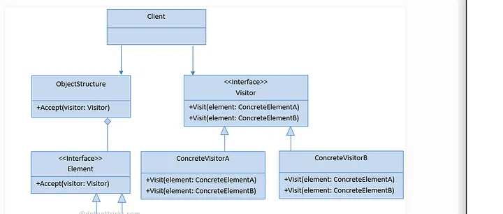

# aula10

-Designer Patterns- Visitor

O Visitor é um padrão de projeto comportamental que permite que você separe algoritmos dos objetos nos quais eles operam.

Um problema que o padrão de projeto Visitor pode resolver é quando temos uma estrutura de objetos complexa e queremos adicionar novas operações a esses objetos sem modificar suas classes.


Descrição do Problema:

Suponha que temos uma hierarquia de classes representando diferentes formas geométricas, como círculos, quadrados e retângulos. Cada forma geométrica tem métodos para calcular sua área e seu perímetro. Agora, queremos adicionar uma nova operação, por exemplo, para desenhar as formas na tela, sem alterar as classes existentes.

Solução utilizando o padrão Visitor:

A ideia básica do padrão Visitor é separar a lógica das operações a serem realizadas em classes separadas, chamadas Visitors, e permitir que essas operações sejam aplicadas a uma estrutura de objetos sem modificar as próprias classes dos objetos.




```JavaScript
// Hierarquia de classes das formas geométricas
class Shape {
    accept(visitor) {
        visitor.visit(this);
    }
}

class Circle extends Shape {
    constructor(radius) {
        super();
        this.radius = radius;
    }
}

class Square extends Shape {
    constructor(side) {
        super();
        this.side = side;
    }
}

// Visitor para calcular a área das formas
class AreaCalculatorVisitor {
    visit(shape) {
        if (shape instanceof Circle) {
            const area = Math.PI * shape.radius * shape.radius;
            console.log(`Área do círculo: ${area.toFixed(2)}`);
        } else if (shape instanceof Square) {
            const area = shape.side * shape.side;
            console.log(`Área do quadrado: ${area.toFixed(2)}`);
        }
    }
}

// Visitor para calcular o perímetro das formas
class PerimeterCalculatorVisitor {
    visit(shape) {
        if (shape instanceof Circle) {
            const perimeter = 2 * Math.PI * shape.radius;
            console.log(`Perímetro do círculo: ${perimeter.toFixed(2)}`);
        } else if (shape instanceof Square) {
            const perimeter = 4 * shape.side;
            console.log(`Perímetro do quadrado: ${perimeter.toFixed(2)}`);
        }
    }
}

// Uso dos Visitors
const circle = new Circle(5);
const square = new Square(4);

const areaCalculator = new AreaCalculatorVisitor();
const perimeterCalculator = new PerimeterCalculatorVisitor();

circle.accept(areaCalculator);
circle.accept(perimeterCalculator);

square.accept(areaCalculator);
square.accept(perimeterCalculator);
```


Temos uma hierarquia de classes Shape, Circle e Square.
Criamos dois Visitors, AreaCalculatorVisitor e PerimeterCalculatorVisitor, para calcular a área e o perímetro das formas geométricas.
Cada Visitor implementa um método visit(shape) que calcula a área ou o perímetro, dependendo do tipo de forma geométrica.
Cada forma geométrica possui um método accept(visitor) que aceita um Visitor e o utiliza para calcular a área ou o perímetro.
Ao executar este código, ele calculará e exibirá a área e o perímetro de um círculo e de um quadrado. Este exemplo demonstra como o padrão Visitor permite adicionar novas operações (como calcular área ou perímetro) sem modificar as classes existentes (formas geométricas).